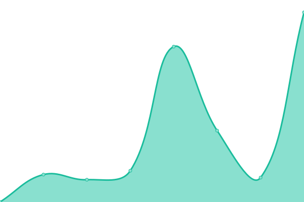
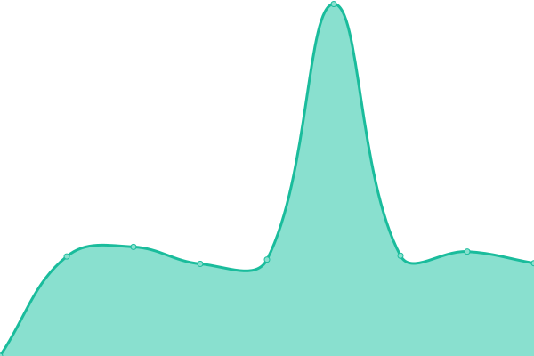

# [📈 Live Status](https://ccp-eva.github.io/uptime-monitor): <!--live status--> **🟩 All systems operational**

This repository contains the open-source uptime monitor and status page for [Comparative Cultural Psychology](https://www.eva.mpg.de/comparative-cultural-psychology/), powered by [Upptime](https://github.com/upptime/upptime).

With [Upptime](https://upptime.js.org), you can get your own unlimited and free uptime monitor and status page, powered entirely by a GitHub repository. We use [Issues](https://github.com/ccp-eva/uptime-monitor/issues) as incident reports, [Actions](https://github.com/ccp-eva/uptime-monitor/actions) as uptime monitors, and [Pages](https://ccp-eva.github.io/uptime-monitor) for the status page.

<!--start: status pages-->
<!-- This summary is generated by Upptime (https://github.com/upptime/upptime) -->
<!-- Do not edit this manually, your changes will be overwritten -->
<!-- prettier-ignore -->
| URL | Status | History | Response Time | Uptime |
| --- | ------ | ------- | ------------- | ------ |
|  [Max Planck Institute for Evolutionary Anthropology](https://www.eva.mpg.de/index/) | 🟩 Up | [max-planck-institute-for-evolutionary-anthropology.yml](https://github.com/ccp-eva/uptime-monitor/commits/HEAD/history/max-planck-institute-for-evolutionary-anthropology.yml) | 

 1539ms
     
 | 

<a href="https://ccp-eva.github.io/uptime-monitor/history/max-planck-institute-for-evolutionary-anthropology">100.00%</a>
    

|  [Kinder schaffen Wissen](https://kinderschaffenwissen.eva.mpg.de/) | 🟩 Up | [kinder-schaffen-wissen.yml](https://github.com/ccp-eva/uptime-monitor/commits/HEAD/history/kinder-schaffen-wissen.yml) | 

 1678ms
     
 | 

<a href="https://ccp-eva.github.io/uptime-monitor/history/kinder-schaffen-wissen">100.00%</a>
    

|  [OpenEvo](https://openevo.eva.mpg.de/) | 🟩 Up | [open-evo.yml](https://github.com/ccp-eva/uptime-monitor/commits/HEAD/history/open-evo.yml) | 

 1915ms
     
 | 

<a href="https://ccp-eva.github.io/uptime-monitor/history/open-evo">100.00%</a>
    

|  [OpenEvo Learning Hub](https://openevo-learninghub.eva.mpg.de/) | 🟩 Up | [open-evo-learning-hub.yml](https://github.com/ccp-eva/uptime-monitor/commits/HEAD/history/open-evo-learning-hub.yml) | 

 989ms
     
 | 

<a href="https://ccp-eva.github.io/uptime-monitor/history/open-evo-learning-hub">100.00%</a>
    

|  [Gaze Following Task](https://ccp-odc.eva.mpg.de/gafo-demo/) | 🟩 Up | [gaze-following-task.yml](https://github.com/ccp-eva/uptime-monitor/commits/HEAD/history/gaze-following-task.yml) | 

 629ms
     
 | 

<a href="https://ccp-eva.github.io/uptime-monitor/history/gaze-following-task">100.00%</a>
    

<!--end: status pages-->

[**Visit our status website →**](https://ccp-eva.github.io/uptime-monitor)

## 📄 License

- Powered by: [Upptime](https://github.com/upptime/upptime)
- Code: [MIT](./LICENSE) © [Comparative Cultural Psychology](https://www.eva.mpg.de/comparative-cultural-psychology/)
- Data in the `./history` directory: [Open Database License](https://opendatacommons.org/licenses/odbl/1-0/)
